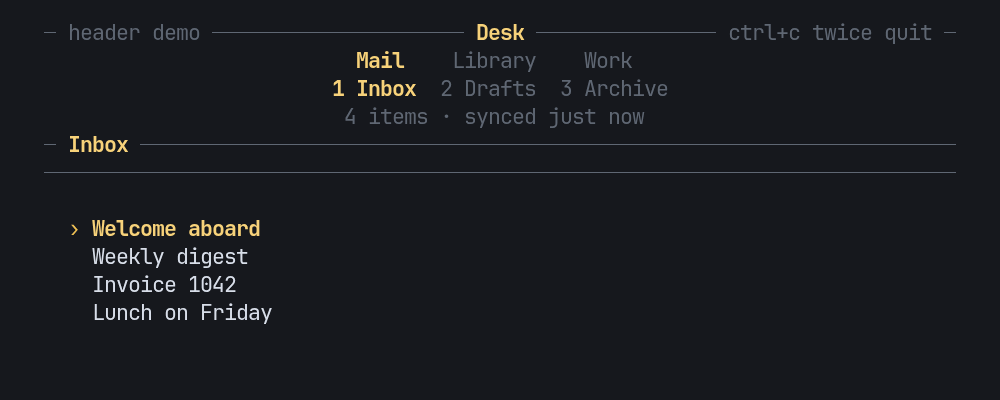

# pito-header

[](https://github.com/gmrdad82/pito-header/actions/workflows/ci.yml)



The top of a [PITO](https://pitomd.com) terminal app, as a small ratatui 0.30
crate: groups of numbered sections drawn as two nested rows, drill-in with a
breadcrumb, and optional title, facts and notice rows. The look is in the
style of HEY's terminal UI. It has no app logic and no words of its own: the
app passes in every name, every style and every key.

It is not on crates.io: add it to your `Cargo.toml` from git, pinned to a
release tag.

```toml
pito-header = { git = "https://github.com/gmrdad82/pito-header", tag = "v0.2.0" }
```

Try it with `cargo run --example demo --features crossterm`: `tab` and
`shift+tab` change group, `]` and `[` change section, a digit jumps to a
section, `enter` drills in, `esc` goes back and `q` quits at the top.

Turn on the `crossterm` feature for `Key::from(crossterm::event::KeyEvent)`
(crossterm 0.29); without it the crate has no backend dependency. The
conversion keeps Alt apart (`Key::Alt('q')` is not `Key::Char('q')`, so Alt+q
is not Back), turns Alt, Super, Meta or Hyper on any other key into
`Key::Other`, and passes Ctrl+Alt plus a character on as that character, which
is how AltGr arrives on some platforms, so diacritics can still be typed.

## What it does

- **Groups and numbered sections, as data.** Sections are numbered 1, 2, 3…
  across all groups, so a digit jumps anywhere; `0` is the tenth, and its label
  draws `0`.
- **Two nested rows,** the groups over the current group's sections,
  centred, the current one in the accent and bold. When the width runs out
  they abbreviate step by step and never wrap: full names, then each
  section's short name, then only the current one named, then numbers only.
  A group falls back to its short name, then its first letter.
- **Drill-in.** `open(title, selected)` goes one level deeper and remembers
  the list's selection; back returns it, so the list comes back where it
  was. Each section keeps its own stack while you move around. While drilled
  in, the header swaps the sections row for the breadcrumb rule, as HEY
  does (see [Drilling in](#drilling-in)). The breadcrumb ("Checks /
  nightly") elides the middle, then the head, when it doesn't fit.
- **Keys map to actions; nothing is taken behind the app's back.**
  `action(key)` only looks; `apply(action)` moves; `key(key)` does both.
  Every key set is configurable through `NavKeys` (`NavKeys::NONE` takes
  nothing), so `tab`, `[ ]`, digits or `q` can keep other meanings in an app.
  Back at the top level is never an action, so `esc` stays the app's there.
  With a single group, `tab` steps sections.
- **Digits past the last section** do nothing and fall through to the app,
  unless `swallow_digits` is on: then they map to `Action::Swallow`, which
  `apply` answers with `Step::Swallowed`, so the key is taken and nothing
  moves. Off by default, and only while `digits` is on.
- **`cycle(by)` and `step(by)`** move by the size of `by` (negative goes
  back) and wrap. `cycle` counts filled groups only and answers `None` when
  there is no other group to go to; `cycle(0)` and `step(0)` stay where they
  are and answer the place.
- **Every group remembers its section:** `selected(group)` reads it from
  anywhere, so the app can jump to a group at its remembered section with
  `go_to(group, section)`, or show another group's section.
- **A header with no sections** (a dashboard) draws only the rows it's given.
- **Optional rows** in `Header`: a title rule with the name in the middle
  and a left and a right slot (they drop when there's no room), the nav
  rows, a facts row (each fact styled by the app, on a rule or plain), the
  breadcrumb rule, a closing rule, and a notice row (a result, a warning, or
  a confirm question). Text on a rule (the title, its slots, the facts, the
  breadcrumb) carries exactly its own style: the rule's modifiers, such as
  DIM, never leak into it.
- **A slot in several styles:** `left_parts` and `right_parts` take a
  slice of facts drawn side by side, such as a muted label and an accent
  value; when the slot is cut, the ellipsis takes the style of the part it
  cuts. The last call of `left`/`left_parts` (or `right`/`right_parts`)
  wins.
- **Styled sections.** `Section::spans` gives a section several styled spans,
  such as a host name next to its state. Each span draws in its own style over
  the cell's, so the selected section keeps its accent and bold on the whole
  cell, a span with no colour of its own takes the cell's, and `short` still
  sets the abbreviation as plain text. `short_spans` sets it as styled spans
  instead, drawn the same way in the short and lone forms; the last of the two
  calls wins. Abbreviation and clipping work as for a plain label, and a click
  anywhere on the cell lands on the section.
- **A label that changes while the app runs:** `nav.section_mut(group,
  section)` hands out the section, and `set_name`, `set_spans`, `set_short`
  and `set_short_spans` change its label in place, so the current place, every
  group's remembered section and every section's drill stack stay.
- **Texts the app owns as `String`s:** `facts_pairs`, `left_pairs` and
  `right_pairs` take a slice of `(String, Style)` and draw it like the
  `Fact` forms, so the app needs no parallel `Vec<Fact>` each frame.
- **Empty facts are skipped,** and a row of only empty facts takes no row. The
  row elides with "…" only when the room left cannot hold the separator and
  the next fact's first two cells (or the whole fact, if it is narrower); a cut
  fact ends the row. An empty `title` is no title.
- **Control characters take no cell:** a newline, tab or carriage return
  inside a text is measured and drawn as one space between its two sides, and
  one at either end is dropped, so a multi-line message reads as one line.
- **Clicks:** `hit(area, column, row)` names the group or section under the
  pointer, and nothing outside the area; the crate never reads the mouse
  itself.
- **Widths by cell:** Unicode widths throughout, so diacritics (ă, î, ș, ț),
  "…" and wide glyphs measure and clip cleanly.
- **Cheap:** drawing writes straight into the buffer, with no allocation
  and no clock; well under a millisecond at 150×40 (`cargo run --release
  --example bench`).

## The API

```text
pub enum Key { Char(char), Ctrl(char), Alt(char), Tab, BackTab, Enter, Esc, Backspace,
               Left, Right, Up, Down, Other }          // non_exhaustive
pub struct Styles { accent, muted, rule }              // plain fields; Styles::new() and the builders are the stable way to build it
Section::new(name).short(short)
Section::spans(&[(text, Style)]).short(short)          // one label in several styles
Section::spans(..).short_spans(&[(text, Style)])         // the abbreviation in several styles
  section.set_name(..), set_spans(..), set_short(..), set_short_spans(..)   // change a label in place
Group::new(name).short(short).section(section)
Nav::new(groups).keys(NavKeys)
  place() -> Place { group, section, number }          // number is 1-based, 0 when empty
  selected(group) -> Option<usize>                     // the section a group remembers
  section(), section_mut(group, section) -> Option<&mut Section>
  count(), go(number), go_to(group, section), cycle(by), step(by)
  open(title, selected), back() -> Option<usize>, close() -> Option<usize>
  depth(), title(), crumbs(), breadcrumb() -> String
  action(Key) -> Option<Action>, apply(Action) -> Option<Step>, key(Key) -> Option<Step>
pub enum Action { NextGroup, PrevGroup, NextSection, PrevSection, Go(usize), Back, Swallow }   // non_exhaustive
pub enum Step { Moved(Place), Back { selected }, Swallowed }                                   // non_exhaustive
NavKeys { next_group, prev_group, next_section, prev_section, back: &'static [Key], digits,
          swallow_digits }                             // non_exhaustive; digits past the last section are taken
  NavKeys::HEY: tab / backtab, ] / [, digits, esc / q          NavKeys::NONE
  .next_group(..) .prev_group(..) .next_section(..) .prev_section(..) .back(..)   // const builders
  .digits(bool) .swallow_digits(bool)
NavBar::new(&nav).styles(..).lit(bool).groups(bool).underline(bool); height(), hit(..)
Breadcrumb::new(&nav).styles(..).centred(bool)
Fact::new(text, style)
pub enum Drill { Replace, Rows }                       // Replace by default; non_exhaustive
Header::new(&nav).styles(..).title(..).left(..).right(..).tabs(bool).lit(bool)
  .left_parts(&[Fact]).right_parts(&[Fact])           // a slot in several styles
  .left_pairs(&[(String, Style)]).right_pairs(&[(String, Style)]).facts_pairs(&[(String, Style)])
  .underline(bool).facts(&[Fact]).facts_rule(bool).separator(..).crumbs(bool)
  .closing(bool).notice(Option<Fact>).drill(Drill); height(), hit(..)
```

Every public enum, and `NavKeys` and `Styles`, are `#[non_exhaustive]`: match
them with a wildcard arm, and build the structs with `new()`, `HEY` or `NONE`
and their methods, so a later release can add to them in a minor version.

`lit(false)` keeps the group lit but dims the current section, for a page
that sits over every section (help, settings). `underline(true)` underlines
the section numbers.

## Drilling in

When the nav is drilled in (`depth() > 0`), `Header` draws the way HEY's
terminal UI does: the title rule and the groups row stay, the sections row
becomes a rule with the breadcrumb centred in the accent, and the facts and
breadcrumb rows step aside, so `height()` shrinks by them. Back brings the
sections row back with the selection kept. Clicks on the breadcrumb rule hit
nothing. An app that needs the separate rows passes `.drill(Drill::Rows)`;
the `Breadcrumb` widget stays for apps that title their own content.

```rust,standalone_crate
use pito_header::{Drill, Group, Header, Nav, Section};

let mut nav = Nav::new(vec![
    Group::new("Library").section(Section::new("Ownership")),
    Group::new("Work").section(Section::new("Checks")),
]);
nav.open("build queue", 3);
assert_eq!(Header::new(&nav).crumbs(true).height(), 2);
assert_eq!(Header::new(&nav).crumbs(true).drill(Drill::Rows).height(), 3);
assert_eq!(nav.back(), Some(3));
```

```text
────────────────────────── Desk ──────────────────────────
                 Mail    Library    Work
       4 Items & notes  5 Collections  6 Ownership
────────────── 12 owners · synced just now ───────────────

────────────────────────── Desk ──────────────────────────
                 Mail    Library    Work
──────────────── Ownership / build queue ─────────────────
```

## Example

```rust,standalone_crate
use pito_header::{Fact, Group, Header, Key, Nav, Section, Step, Styles};
use ratatui::{Frame, layout::Rect, style::{Color, Modifier, Style}};

fn nav() -> Nav {
    Nav::new(vec![
        Group::new("Mail").section(Section::new("Inbox")).section(Section::new("Drafts")),
        Group::new("Library").section(Section::new("Items & notes").short("Items")),
    ])
}

fn key(nav: &mut Nav, key: Key, selected: &mut usize) {
    match nav.key(key) {
        Some(Step::Back { selected: kept }) => *selected = kept,
        Some(Step::Moved(_)) => *selected = 0,
        Some(Step::Swallowed) => {}
        Some(_) => {}
        None if key == Key::Enter => nav.open(format!("item {selected}"), *selected),
        None => {}
    }
}

fn draw(frame: &mut Frame, nav: &Nav) {
    let dim = Style::new().add_modifier(Modifier::DIM);
    let styles = Styles::new().accent(Style::new().fg(Color::Magenta)).muted(dim).rule(dim);
    let facts = [Fact::new("12 items", dim), Fact::new("synced just now", dim)];
    let header = Header::new(nav)
        .styles(styles)
        .title(Some("Desk"))
        .right(Some(Fact::new("? help", dim)))
        .facts(&facts)
        .crumbs(true);
    let area = frame.area();
    frame.render_widget(header, Rect { height: header.height(), ..area });
}
```

## Development

`bin/gate` runs `cargo fmt --check`, `cargo clippy --all-targets
--all-features -- -D warnings`, `cargo test --all-features` (the tests draw
through ratatui's `TestBackend`, a counting allocator holds that drawing and
hit-testing allocate nothing, and this README's example compiles as a
doctest) and builds the bench. `bin/gate --fast` leaves the bench build
out, and CI runs it on every push and pull request to main. `bin/demo-gif`
records the demo from `render/terminal.toml` and its tape into
`docs/demo.gif`.

## Contributing

Issues and pull requests are welcome. Please read the
[code of conduct](CODE_OF_CONDUCT.md) first. A change keeps `bin/gate` green
with no warnings, draws without allocating, and leaves every word, style and
key to the app. Report a security issue privately, as
[SECURITY.md](SECURITY.md) says, not in a public issue.

## Licence

The code is MIT licensed: see [LICENSE](LICENSE), by Catalin Ilinca. The PITO
name and its logos are © Catalin Ilinca, all rights reserved, and are not
covered by the MIT licence. The look is in the style of HEY's terminal UI;
see [NOTICE.md](NOTICE.md).
